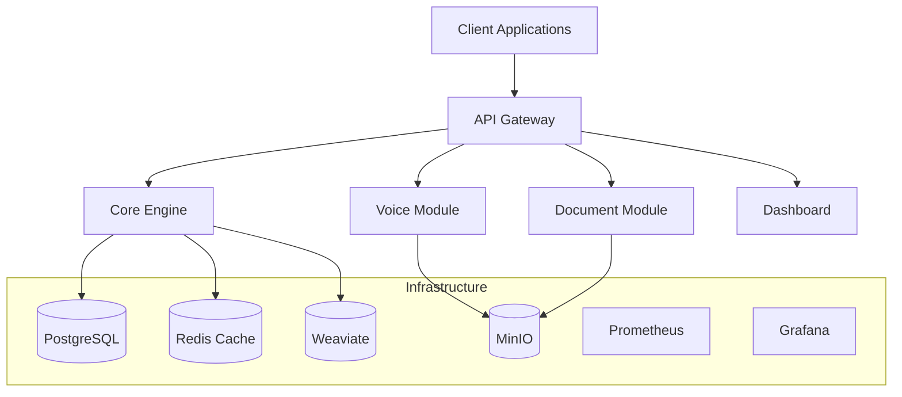
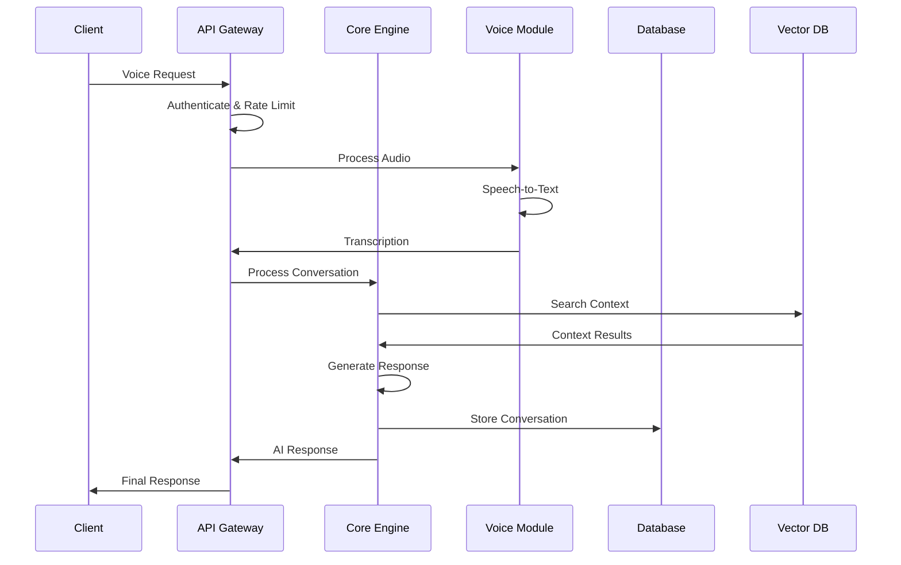
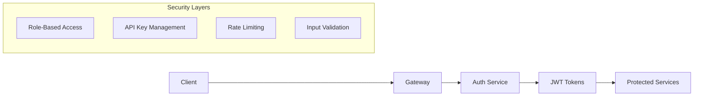

# System Architecture Overview

## AI Voice Agent v3 - Architecture Documentation

### Table of Contents
- [System Overview](#system-overview)
- [Service Architecture](#service-architecture)
- [Data Flow](#data-flow)
- [Infrastructure](#infrastructure)
- [Security Architecture](#security-architecture)
- [Scalability Considerations](#scalability-considerations)

## System Overview

AI Voice Agent v3 is a microservices-based platform designed for real-time voice processing and AI-powered conversations. The system follows a distributed architecture pattern with clear separation of concerns and service boundaries.

### Core Principles

1. **Microservices Architecture**: Each service has a single responsibility
2. **Event-Driven Communication**: Services communicate via events and APIs
3. **Scalability**: Horizontal scaling capabilities for high load
4. **Resilience**: Fault tolerance and circuit breaker patterns
5. **Observability**: Comprehensive monitoring and logging

## Service Architecture

### Service Inventory



### Service Descriptions

#### 1. API Gateway (Port: 8080)
**Purpose**: Central entry point for all client requests
- Request routing and load balancing
- Authentication and authorization
- Rate limiting and throttling
- Request/response transformation
- API versioning

**Technologies**: FastAPI, Redis, Python 3.11

#### 2. Core Engine (Port: 8000)
**Purpose**: AI orchestration and processing engine
- AI model management and routing
- Conversation context management
- Business logic orchestration
- Integration with external AI services
- Response generation and formatting

**Technologies**: FastAPI, OpenAI, Transformers, Python 3.11

#### 3. Voice Module (Port: 8001)
**Purpose**: Real-time voice processing
- Speech-to-text conversion
- Audio preprocessing and enhancement
- Voice activity detection
- Real-time streaming support
- Audio format conversion

**Technologies**: FastAPI, Whisper, PyAudio, WebRTC, Python 3.11

#### 4. Document Module (Port: 8002)
**Purpose**: Document processing and analysis
- PDF, DOCX, TXT processing
- Content extraction and parsing
- Document classification
- Text preprocessing for AI
- Metadata extraction

**Technologies**: FastAPI, PyPDF2, python-docx, Python 3.11

#### 5. Dashboard (Port: 3000)
**Purpose**: Management and monitoring interface
- Service health monitoring
- Configuration management
- Analytics and reporting
- User management
- System administration

**Technologies**: React/Vue.js, Node.js, TypeScript

## Data Flow

### Request Processing Flow



### Data Storage Strategy

#### PostgreSQL (Primary Database)
- User accounts and profiles
- Conversation history
- Service configurations
- Audit logs
- Application metadata

#### Redis (Cache & Sessions)
- Session management
- API rate limiting counters
- Temporary data storage
- Cache for frequently accessed data
- Real-time communication channels

#### Weaviate (Vector Database)
- Document embeddings
- Conversation context vectors
- Semantic search capabilities
- AI model embeddings
- Knowledge base storage

#### MinIO (Object Storage)
- Audio file storage
- Document file storage
- Model artifacts
- Backup files
- Static assets

## Infrastructure

### Containerization
- **Docker**: Service containerization
- **Docker Compose**: Local development orchestration
- **Kubernetes**: Production deployment (optional)

### Networking
- **Service Mesh**: Internal service communication
- **Load Balancing**: Request distribution
- **Service Discovery**: Dynamic service location
- **Circuit Breakers**: Fault tolerance

### Monitoring & Observability
- **Prometheus**: Metrics collection
- **Grafana**: Visualization and dashboards
- **Structured Logging**: JSON-based logging
- **Distributed Tracing**: Request tracing (optional)
- **Health Checks**: Service health monitoring

## Security Architecture

### Authentication & Authorization


### Security Measures
1. **API Gateway Security**
   - JWT token validation
   - API key authentication
   - Rate limiting per user/IP
   - Input sanitization
   - CORS policy enforcement

2. **Service-to-Service Communication**
   - Internal API keys
   - Service mesh security
   - Network segmentation
   - Encrypted communication (TLS)

3. **Data Protection**
   - Encryption at rest
   - Encryption in transit
   - PII data anonymization
   - Secure key management
   - Audit logging

## Scalability Considerations

### Horizontal Scaling
- **Service Replication**: Multiple instances per service
- **Load Balancing**: Traffic distribution
- **Database Scaling**: Read replicas and sharding
- **Cache Scaling**: Redis clustering

### Performance Optimization
- **Async Processing**: Non-blocking operations
- **Connection Pooling**: Database connection optimization
- **Caching Strategy**: Multi-level caching
- **CDN Integration**: Static asset delivery

### Resource Management
- **Auto-scaling**: Based on CPU/memory metrics
- **Resource Limits**: Container resource constraints
- **Queue Management**: Background task processing
- **Circuit Breakers**: Prevent cascade failures

## Deployment Patterns

### Development Environment
```yaml
# docker-compose.yml structure
services:
  - api-gateway (dev mode)
  - core-engine (dev mode)
  - voice-module (dev mode)
  - document-module (dev mode)
  - dashboard (dev mode)
  - postgres (single instance)
  - redis (single instance)
  - weaviate (single instance)
  - minio (single instance)
```

### Production Environment
```yaml
# Production deployment considerations
services:
  - Multiple service replicas
  - Database clustering
  - Redis clustering
  - Load balancers
  - SSL/TLS termination
  - Monitoring stack
  - Backup systems
```

## Technology Stack Summary

| Component | Technology | Version | Purpose |
|-----------|------------|---------|---------|
| **Backend Framework** | FastAPI | 0.104+ | API development |
| **Runtime** | Python | 3.11+ | Application runtime |
| **Database** | PostgreSQL | 15+ | Primary data storage |
| **Cache** | Redis | 7+ | Caching & sessions |
| **Vector DB** | Weaviate | 1.22+ | AI embeddings |
| **Object Storage** | MinIO | Latest | File storage |
| **Containerization** | Docker | Latest | Application packaging |
| **Orchestration** | Docker Compose | Latest | Local development |
| **Monitoring** | Prometheus + Grafana | Latest | Observability |
| **AI Models** | OpenAI + Transformers | Latest | AI processing |

---

*This document is part of the AI Voice Agent v3 architecture documentation. For more detailed information about specific services, refer to their individual documentation.*